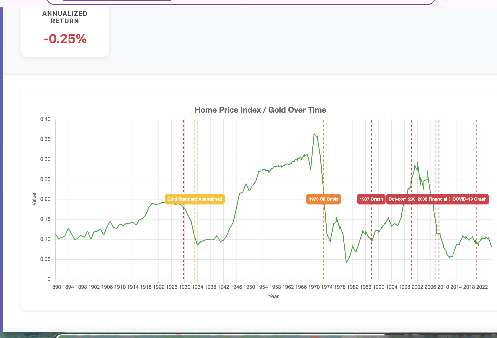

# Shiller vs Gold

A web-based visualization tool that combines Robert Shiller's CAPE ratio and home price data with historical gold prices to show relative market valuations over time. Similar to [strategyrainbow.com](https://strategyrainbow.com), this tool helps identify periods of market overvaluation or undervaluation.



**Live Demo**: [https://posix4e.github.io/shillervsgold/](https://posix4e.github.io/shillervsgold/)

## Features

- **Flexible Asset Comparison:**
  - Compare any built-in asset (CAPE, Home Price Index, S&P 500, Gold)
  - Search and add any ticker from Polygon.io (stocks, crypto, ETFs, etc.)
  - Value assets in any denominator (Real USD, Nominal USD, Gold, Homes, S&P 500, or custom tickers)
  - Investment return calculator with date range selection

- **Asset Search:**
  - Type to search built-in assets (home, gold, cape, sp500)
  - Enter any Polygon.io ticker (BTC-USD, TSLA, AAPL, etc.)
  - Autocomplete suggestions with descriptions
  - Cached data for fast repeated queries

- **Flexible Date Ranges:**
  - British History (1250+ for gold)
  - Modern History (1871+ for stocks)
  - Last 50 or 100 years
  - Custom date range selection

- **Historical Event Annotations:**
  - 1929 Stock Market Crash
  - 1933 Gold Standard Abandoned
  - 1973 Oil Crisis
  - 1987 Black Monday
  - 2000 Dot-com Bubble
  - 2007 Housing Bubble Peak
  - 2008 Financial Crisis
  - 2020 COVID-19 Crash

- **Real-time Statistics:**
  - Current CAPE ratio
  - Current gold price
  - CAPE/Gold ratio
  - Historical percentile ranking

## Data Sources

- **Shiller Data**: [Shiller Wrapper Data](https://posix4e.github.io/shiller_wrapper_data/)
  - Stock market data (1871-present)
  - Home price data (1890-present)
  - Source: Robert Shiller's research at Yale University

- **Gold Prices**: [FreeGoldAPI](https://freegoldapi.com/)
  - Historical gold prices (1258-2025)
  - Updated daily at 6 AM UTC

## How to Use

1. Open `index.html` in a web browser
2. Select a chart type from the dropdown menu
3. Choose a date range to analyze
4. View historical events marked on the chart
5. Check the statistics panel for current valuations and percentile rankings

## Interpretation

- **High CAPE/Gold Ratio** (>80th percentile): May indicate stock market overvaluation relative to gold
- **Low CAPE/Gold Ratio** (<20th percentile): May indicate stock market undervaluation relative to gold
- **Historical Events**: Vertical dashed lines show major economic events for context

## Technical Details

- Built with vanilla JavaScript, HTML, and CSS
- Uses Chart.js for visualization
- **No build step or preprocessing** - loads data directly from APIs
- Fetches data on-demand from Polygon.io for custom tickers
- Client-side inflation adjustments using CPI data
- No backend or Node.js required - runs entirely in the browser

## Architecture

The application uses a **direct API loading approach**:

1. **Data Loading (`app.js`)**:
   - Fetches stock/CAPE data from Shiller Wrapper Data API
   - Fetches gold prices from FreeGoldAPI
   - Fetches home price data from Shiller Wrapper Data API
   - Polygon.io integration for custom tickers (BTC-USD, TSLA, AAPL, etc.)

2. **Client-Side Processing**:
   - Real-time CPI-based inflation adjustments
   - Dynamic ratio calculations (any asset vs any denominator)
   - Cross-asset date matching and lookups
   - Investment return calculations

3. **No Build Required**:
   - No preprocessing step
   - No npm dependencies
   - Just open `index.html` in a browser

## Local Development

1. Start a local server:
   ```bash
   # Python 3
   python3 -m http.server 8000

   # Or use any static file server
   npx serve
   ```

2. Visit `http://localhost:8000` in your browser

3. That's it! No build step needed.

## Deployment

### GitHub Pages (Recommended)

1. Push to GitHub
2. Enable GitHub Pages in repository settings (deploy from main branch)
3. Done! No build process needed.

### Other Hosting

Deploy as a static site to any hosting service:
- Netlify (no build command needed)
- Vercel (no build command needed)
- AWS S3 + CloudFront
- Any static web host

Just upload the files - no preprocessing or build step required.

## Credits

- Data from Robert Shiller's research at Yale University
- Gold price data from FreeGoldAPI
- Inspired by [strategyrainbow.com](https://strategyrainbow.com)
- Built by the same team behind [btc-mnav-rainbow](https://github.com/posix4e/btc-mnav-rainbow)

## License

MIT License - Feel free to use and modify as needed.
